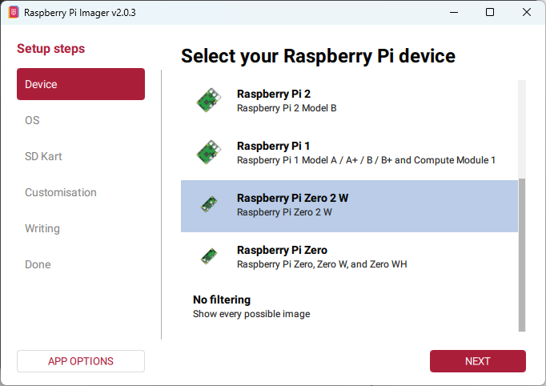
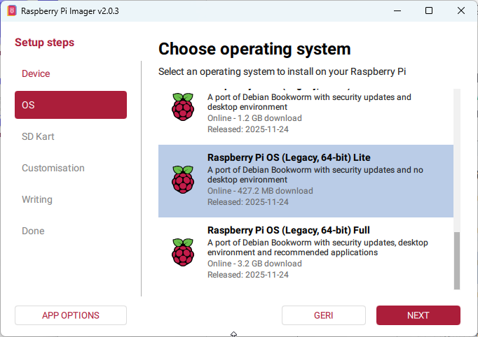
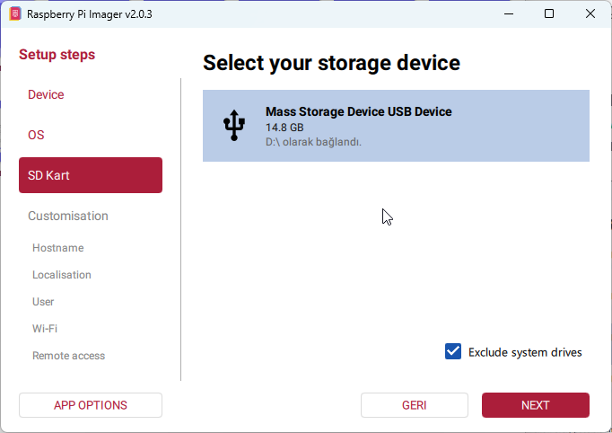
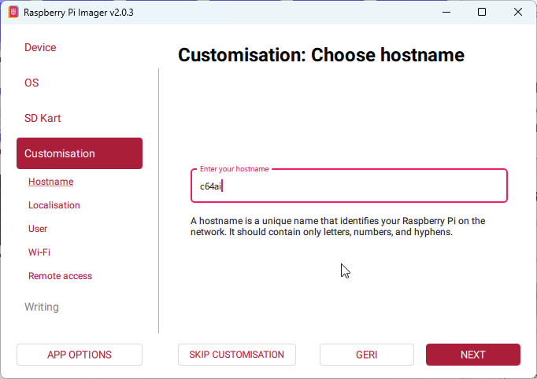
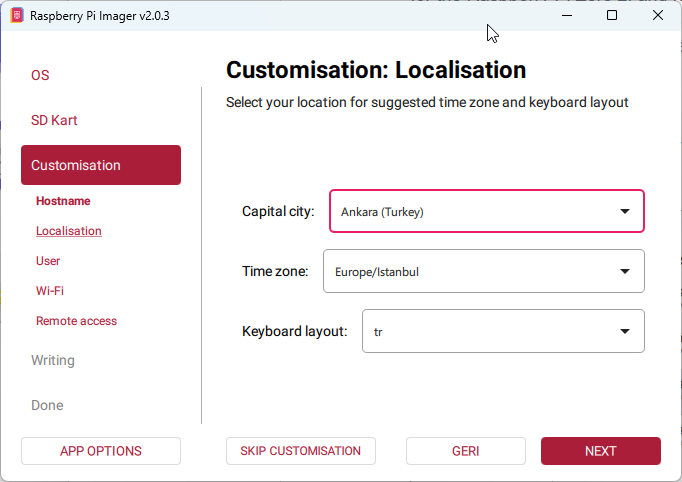
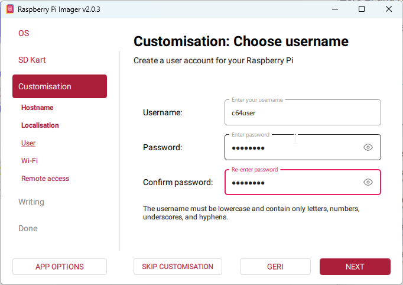
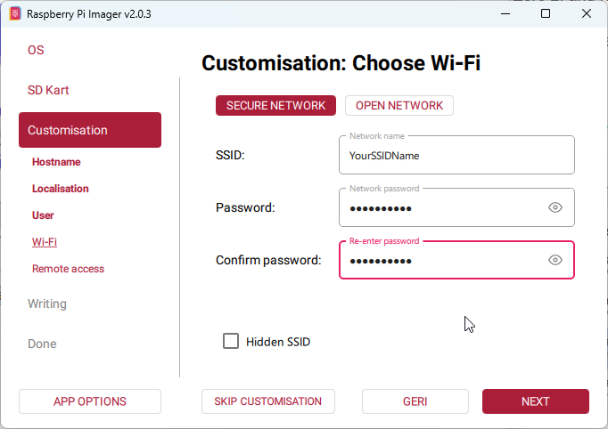
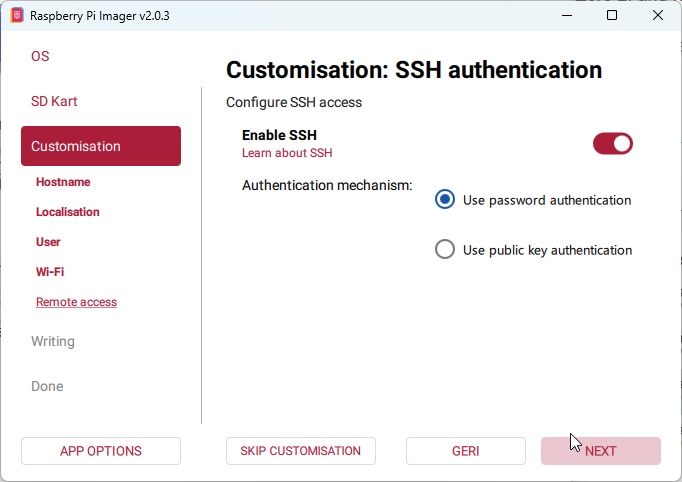
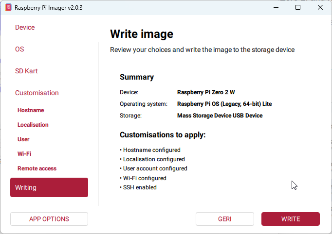
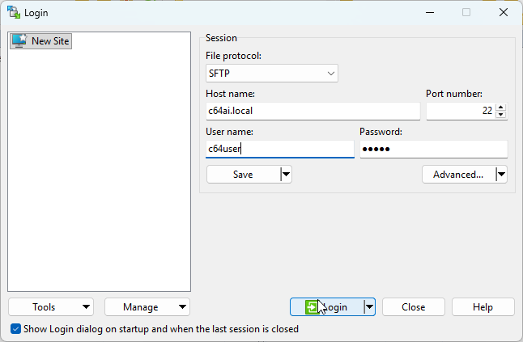

# SD Card Installation Guide for C64AI

## Write Image
This document provides a step-by-step guide for writing the Raspberry Pi OS (Legacy, 64-bit) Lite image to an SD card for the Raspberry Pi Zero 2, and for configuring SSH, Wi-Fi, username, and hostname settings prior to the first boot. It is a visual, practical installation guide designed for headless setup scenarios.

At the first step, the **Raspberry Pi Imager** application must be downloaded from https://www.raspberrypi.com/software according to the operating system being used.

The preparation of this image will be explained using the Windows operating system.

For ease of use throughout the guide, it is recommended to use **c64user** as the default username and **c64ai** as the default hostname.



















## Prerequisite: Ensure SSH is installed

After writing the RPi image to the SD card, access the Raspberry Pi Zero 2 system using PowerShell with the following command:
```bash
ssh c64user@c64ai.local
```
**Installing SSH on Windows 11 (if not already installed):**

1. Open the **Start Menu** and search for **“Turn Windows features on or off”**.
2. In the window that appears, locate **OpenSSH Client**.
3. Check the box next to **OpenSSH Client** and click **OK**.
4. Wait for Windows to apply the changes, then restart PowerShell.
5. Verify the installation by running:
```bash
ssh -V
```
This should display the installed SSH version.

If the following command returns an error:
```bash
ssh c64user@c64ai.local
```
it is recommended to remove the existing SSH host key using the command below and then retry the connection:
```bash
ssh-keygen -R c64ai.local
```
## System Update, Deno Installation

After a successful connection, enter the following commands in the console to update the system, install Deno, and restart the device.
```bash
sudo apt update -y
```
Updates the package list from the repositories.
```bash
sudo apt upgrade -y
```
Upgrades all installed packages to their latest available versions.
```bash
curl -fsSL https://deno.land/install.sh | sh
```
Downloads and installs **Deno** using the official installation script.
```bash
sudo apt install mc
```
Installs **Midnight Commander (mc)**, a text-based file manager that allows easy file and directory management directly from the terminal.
```bash
sudo reboot
```
Restarts the system to apply the changes.

## File Transfer to Raspberry Pi Zero 2

For transferring files to the Raspberry Pi Zero 2, it is recommended to use **WinSCP** or **FileZilla**. Both applications communicate with the device using the **SFTP (SSH File Transfer Protocol)**.

To establish a connection, use the following settings:

* **Protocol:** SFTP
* **Server / Host name:** `c64ai.local`
* **Username:** `c64user`
* **Port:** `22`
* **Password:** The password defined during image preparation

After entering these details, connect to the device and transfer files between your Windows system and the Raspberry Pi Zero 2 as needed.

**Download links:**

* WinSCP: <https://winscp.net>
* FileZilla: <https://filezilla-project.org>



## Configuring AP (Access Point) Mode

AP (Access Point) mode allows the device to create its own wireless network without connecting to an external network. This mode is mainly used for initial setup, configuration, and scenarios where no network access is available, enabling direct access to the device.

When AP mode is enabled, the Raspberry Pi broadcasts its own Wi-Fi network. Users can connect to this network using a computer or mobile device to access the system. This allows SSH access, basic configuration, and secure completion of network settings.

If the Wi-Fi SSID configured for the C64AI project is not accessible, the device will automatically enable AP mode and broadcast a wireless network named **C64AI-Setup**.

### **Enabling and Persisting AP Mode**

If AP mode is active and **C64AI-Setup** appears in the Wi-Fi scan list, the operation is complete. NetworkManager automatically saves the connection.

Enable the AP using the following command:
```bash
sudo nmcli dev wifi hotspot ifname wlan0 ssid C64AI-Setup password 12345678
```
### **Making AP Mode Persistent**

To make the AP start automatically at boot, list the available connections:
```bash
nmcli con show
```
You will most likely see a connection named:
```
Hotspot
```
Configure the connection to start at boot:
```bash
sudo nmcli con modify "preconfigured" connection.autoconnect yes
sudo nmcli con modify "preconfigured" connection.autoconnect-priority -9
sudo nmcli con modify Hotspot connection.autoconnect yes
sudo nmcli con modify Hotspot connection.autoconnect-priority -10
sudo nmcli radio wifi on
```

### **Deploying the setup.service File**

Using **WinSCP**, copy the `setup.service` file from the C64AI project directory:
```
\services\etc\systemd\system\setup.service
```
to the following directory on the Raspberry Pi Zero 2:
```
/etc/systemd/system
```

### **Activating the Service**

Run the following commands to activate the service:
```bash
sudo systemctl daemon-reexec
sudo systemctl daemon-reload
sudo systemctl enable setup.service
sudo systemctl start setup.service
```

### **Copying Setup Files**

Copy the files from the `setup` directory of the C64AI project to the following location on the Raspberry Pi Zero 2:
```
/home/c64user/setup
```
Files to be copied:

* `server.ts`
* `public/index.html`

## Uploading Project Files Using WinSCP

Using **WinSCP**, create a directory named **build** under the following path on the Raspberry Pi Zero 2:
```
/home/c64user
```
Upload the following directories from the project folder to:
```
/home/c64user/build
```
Directories to upload:

* `ask2ai`
* `shutdownled`
* `server`

### Building and Configuring the C64AI Applications

Reconnect to the Raspberry Pi using SSH and access the terminal.
Navigate to the `ask2ai` build directory:
```bash
cd build/ask2ai/
```
Make the build script executable:
```bash
chmod a+x build.sh
```
Run the build script:
```bash
./build.sh
```
Wait for the build process to complete and for the generated binary file to be copied into the `server` directory.
Next, navigate to the server directory:
```bash
cd ../server/
```
Compile the `c64aiserver` application:
```
make
```

#### **Configuring the Gemini API Key**

In the same directory, open the `.env` file using the nano editor:
```bash
nano .env
```
Locate the `<your_api_key>` placeholder, delete it, and paste your **Gemini API key** using right-click.

Save the file and exit nano by pressing the following keys in order:

* `CTRL + O`
* `ENTER`
* `CTRL + X`

You will now return to the terminal.

#### **Copying Files to the Home Directory**

Launch Midnight Commander:
```bash
mc 
```
Using Midnight Commander, copy the following files and directories to:
```
/home/c64user
```
Items to copy:

* `ask2ai`
* `c64aiserver`
* `.env`

#### Building the Shutdown LED Application

After the copy operation is completed in Midnight Commander, press **F10** to exit and return to the terminal.
From the terminal, navigate back to the build directory:
```bash
cd /home/c64user/build
```
Enter the `shutdownled` directory:
```bash
cd shutdownled
```
Before compiling the application, install the required GPIO libraries:
```bash
sudo apt install -y libgpiod-dev gpiod
```
Compile the application:
```bash
make
```
After the build process is complete, use **Midnight Commander** (`mc`) to copy the generated binary file:
```
gpio_shutdown_led
```
to the following directory:
```
/home/c64user
```

### **Uploading systemd Service Files**

From the project directory:
```
\services\etc\systemd\system\
```
upload the following service files to the Raspberry Pi Zero 2 directory:
```
/etc/systemd/system
```
Service files to upload:

* `c64aiserver.service`
* `gpio-shutdown.service`

These files will be used to manage and control the related services on the system.

### Enabling and Starting Services

Run the following commands to activate the services:
```bash
# Reload systemd to recognize the new service files
sudo systemctl daemon-reload
```
Start the services immediately:
```bash
sudo systemctl start c64aiserver
sudo systemctl start gpio-shutdown
```
Enable the services to start automatically at boot:
```bash
sudo systemctl enable c64aiserver
sudo systemctl enable gpio-shutdown
```

## READY.

Your SD card image has been configured for the C64AI project.
To safely power off the Raspberry Pi Zero 2, run the following command in the terminal:
```bash
sudo shutdown -h now
```


